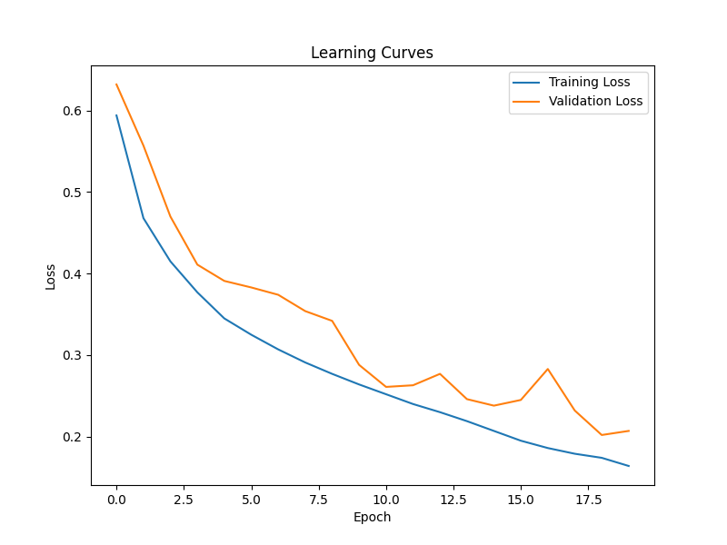

# Polyp-Segmentation-using-UNET-in-TensorFlow-2.0

## Overview
In this chapter, we discuss the work done in the bachelor project and the dataset used in the project. Here's a graph of the work done:

## Datasets
There are two datasets that can be used in medical polyp segmentation, each containing images of the infected region and its segmented polyp label.

Here are the two datasets:
1. **Kvasir-SEG dataset:** Consists of 1,000 polyp images and their corresponding ground truth masks annotated by expert endoscopists from Oslo University Hospital (Norway).
2. **CVC-ClinicDB database:** An open-access dataset of 612 images with a resolution of 384×288 from 31 colonoscopy sequences.

In this project, the second dataset (CVC-ClinicDB) is used.

## Data Preprocessing
### Step 1:
- The dataset is read and stored in two variables: one to hold the input images and one to hold the labels.
- The `train_test_split()` function from the scikit-learn library is used to split the dataset into train and test sets, and then the train dataset is split again into train and validation sets.

### Step 2:
- The `read_image()` function reads the images and stores each as a numpy array, ensuring all images have the same dimensions (256x256).
- Images are normalized by dividing pixel values by 255, ensuring values are between 0 and 1.

### Step 3:
- Input images have dimensions 256x256x3 (RGB format), while labels have dimensions 256x256x1 (black or white).

## Model
An overview of the U-Net model used for segmentation. More details in section "U-Net Model."

- Code written in Python using TensorFlow for deep learning.
- `conv_block(x, num_filters)` function creates a convolutional block with layers, batch normalization, and ReLU activation.
- U-Net architecture: encoder, decoder, and bridge connecting them.
- Encoder downsamples input using max-pooling and applies convolutional blocks.
- Bridge connects encoder and decoder.
- Decoder upsamples feature maps and uses skip connections.
- Output layer uses 1x1 convolution with sigmoid activation for binary mask.

## Training Details
Details about the model's training phase, parameters, and results.

### Parameters
- Batch size: 8
- Epochs: 20
- Adam optimizer, Binary Cross-Entropy loss, Learning rate: 0.0001
- Metrics: Accuracy, Precision, Recall, IOU

### Dataset Percentage
- Train: 80%
- Validation: 10%
- Test: 10%

### Training Procedure
- Import necessary libraries.
- Define functions, load dataset, set hyperparameters.
- Create train and validation datasets, build U-Net model.
- Compile model, define callbacks.
- Train model using fit() function.
- Evaluate metrics and save results.

### Post-processing
Details about post-processing to refine segmentation results.

1. Obtaining grayscale probability map.
2. Determining proper threshold.
3. Cleaning results using morphologyEx.

## Training Analysis
Detailed analysis of evaluation metrics and model performance.

### Evaluation Metrics Analysis
- Accuracy, IoU, Loss, Learning Rate, Precision, Recall.
- Graphs indicate model improvement over epochs.

### Learning Curves
- Training loss, validation loss, training accuracy, validation accuracy.

# Results and Discussions

## Overview
In this section, some of the promising results and wrong results will be shown and illustrated, in addition to analyzing the evaluation metrics for the testing data.

## Results
- **Promising results**

From the promising results, it can be noticed that the polyp is correctly positioned and segmented, and the input image is clear enough to be used without distracting or noisy lighting.

- **Wrong results**

From the wrong results, it can be noticed that:
  - **Example 1:** The model failed to segment the polyp due to noisy lighting. The polyp is obscured by the lighting, making it indistinguishable from the normal region.
  - **Example 2:** The model positioned the polyp in the wrong place, possibly due to the presence of swellings that resemble the polyp. The noisy lighting further contributed to the wrong placement.

## Post-processing results
After applying post-processing techniques mentioned in the previous section (Post-processing), the results are improved. Here are the post-processed results:

In the grayscale (probability map), the polyp is segmented but with low intensity. Lowering the threshold reveals the polyp, and after cleaning, the result is significantly improved. The IoU improved from 0.006 to 0.45.

## Evaluation Metrics Analysis
1. **Measurements:**
   - Loss = 0.1404
   - Accuracy = 0.9601
   - Recall = 0.7589
   - Precision = 0.8377
   - IoU = 0.4267

2. **Analysis:**
   - The loss value of 0.1404 indicates that the model's predictions are closer to the ground truth, indicating good performance.
   - The accuracy value of 0.9601 shows that the model is making correct predictions on the test data.
   - The recall value of 0.7589 suggests that the model effectively captures a significant portion of true positives.
   - The precision value of 0.8377 indicates that the model captures true positive samples while reducing false positives.
   - The IoU value of 0.4267 shows that the model accurately captures object boundaries and performs well in segmentation.

Overall, the evaluation metrics demonstrate that the model performs well on the test data.

